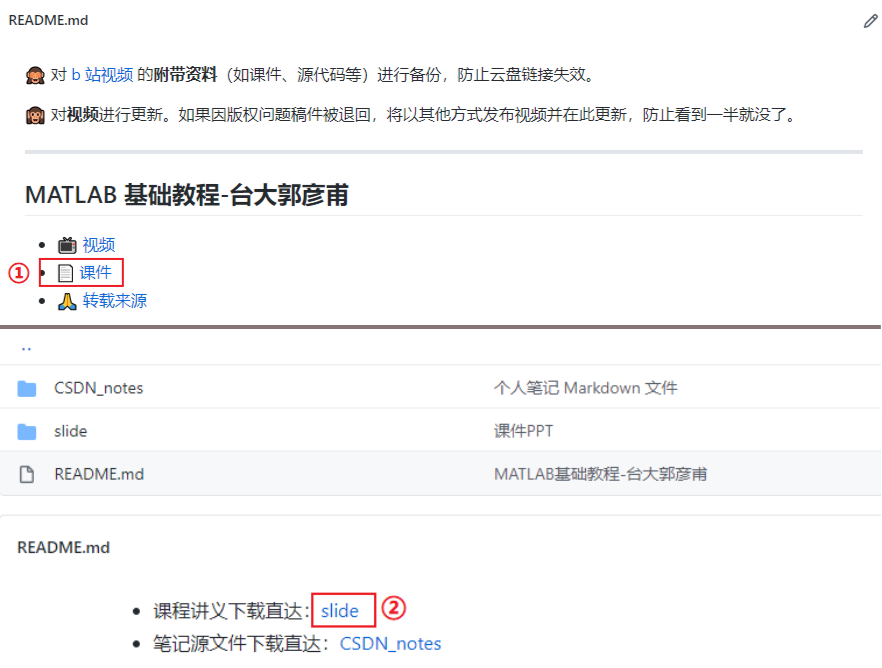
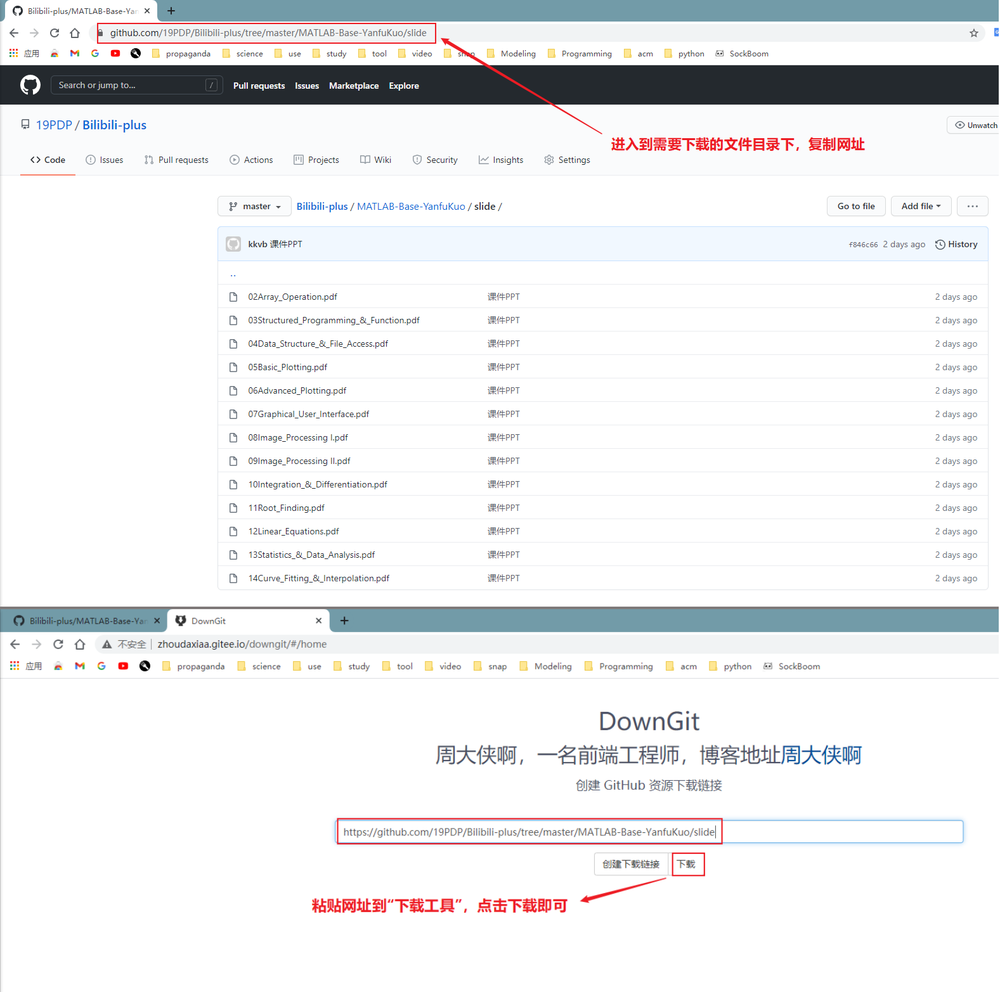

下面提供一种简单可行的方法下载 GitHub 托管的文件，希望可以帮助到一部分同学。

 

简单来说，进入到你需要下载的文件目录下，复制当前网址，然后粘贴到 [这个下载工具](http://zhoudaxiaa.gitee.io/downgit/#/home)，即可直接下载。

比如说我想下载 [郭彦甫MATLAB课程](./MATLAB-Base-YanfuKuo/) 的课件，

1. **先进入到课件目录下：**
   
2. **然后复制这个目录的链接，并拷贝到 [下载工具](http://zhoudaxiaa.gitee.io/downgit/#/home) 下载：**
   