# STL 与泛型编程

> STL 就是泛型编程的最好示例。

通过泛型编程使用 C++ 标准库的 6 大部件。

6 大部件 (Components) ：

- 容器 Containers
- 分配器 Allocators ：容器通常都有默认的分配器，因此不需要使用者操心。
- 算法 Algorithms
- 迭代器 Iterators
- 适配器 Adapters
- 仿函数 Functors

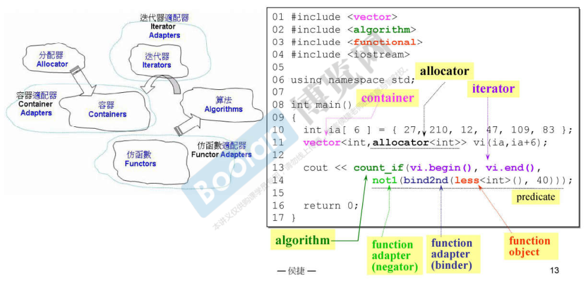

### 容器 - 结构与分类

- 顺序容器：数组或链表实现
- 关联容器
  - 有序：红黑树实现
  - 无序：哈希表实现（一组桶） *C++11*

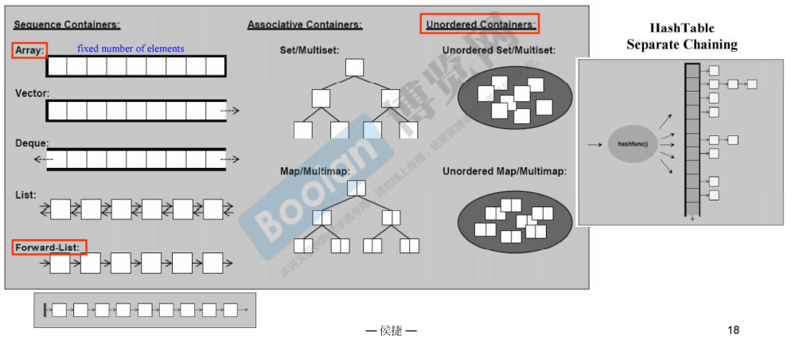

> 红框标注的为 C++11 新增容器，其中 array 是将原本的语言特显变为 array class
>
> vector 的扩充通过“分配器”实现，分配器完成底层的内存分配工作

### OOP vs. GP

面向对象（OOP）企图将 datas 和 methods 关联在一起；
泛型编程（GP）则将 datas 和 methods 分开来。

泛型编程使得容器和算法可以各自闭门造车，它们之间的接口是 Iterators ，算法通过迭代器确定操作范围，并通过迭代器取用容器的元素。

### 分配器

TODO：内存管理

### 容器结构与分类

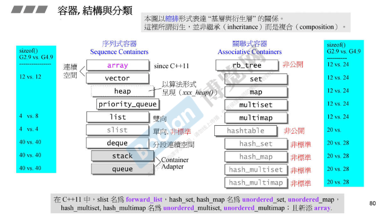

### list

list 的迭代器对前置后后置自增运算符进行重载，如下图所示。注意其中使用 `*this` 时并没有先调用 `*` 运算符，而是直接将 `this` 作为参数调用相应的重载运算符 `=` 、`++`。

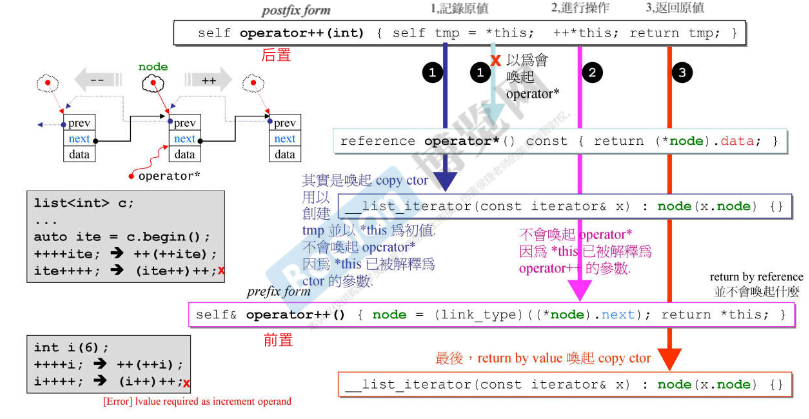

> 后置 `++` 的返回类型不是引用类型。因为为了符合后置自增运算符的特性，返回必须是自增前的值，因此使用局部变量 `self tmp = *this;` 临时保存，当函数体结束，局部变量销毁，自然不能返回其引用值。

### vector

> 参看 *《C++ Primer》* p317

### deque

**deque 对象是如何增长的？**

deque 对象中其实是一连串的指针，每一个指针指向一个 buffer 。buffer 具有固定的长度，能容纳 n 个元素，当 deque 向前或向后增长时首先填充 buffer 内空闲的内存，当 buffer 满了之后再分配新的 buffer。

而存储 deque 中的这一连串指针的正是 vector，它符合 vector 的增长规则，当存储指针的 vector 满了时，动态分配一块两倍大小的内存，并把原来的指针移（数据并不需要移动）到新内存的**中间**。

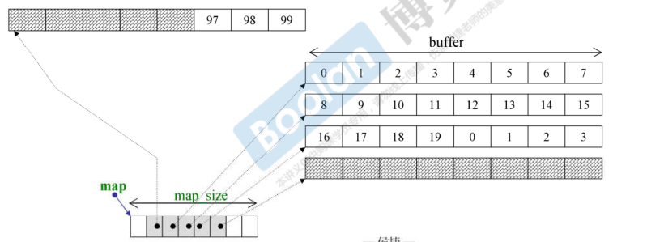

正如你所见，`deque` 容器内的数据并不是连续存放的，而是分段连续的。 `deque` 看起来“连续”的假象都是通过迭代器的精心设计来伪装的。此外 `deque` 底层支持随机访问，容器也提供了 `.at()` 和 `[]`。

> **stack 和 queue 实际上是 deque 容器的适配器**，内涵一个 deque ，各种操作是对 deque 容器的操作的再次封装。
>
> stack 和 queue 也可以选择其他容器作为底层结构（适配其他容器），但所选容器必须支持相对应的操作。*《C++ Primer》* P

### map 和 set

map 和 set 底层都通过红黑树来实现，标准库的实现通常有一个 rb_tree class，从某种意义上来说 map 和 set 也可以说是容器适配器，只不过红黑树的实现并不开放给用户使用。

**关于 `[]` 的效率**：侯捷老师在课程中从源码分析，说明了 `[]` 操作会比直接使用 `.insert()` 方法更慢。但事实上，二者应该是差不多的。`[]` 操作符使用 `lower_bound()` （由于其只接收一个参数，这应该是 map 类自己实现的，而不是标准库的模板函数）查找 key 为 `__k` 的元素：

- 如果没有找到，则插入。但此时调用 `.insert()` 时提供了应该插入的位置的迭代器 `__i`，因此 `.insert()` 函数可以直接插入并调整红黑树。如果没有 `__i` 直接使用 `.insert()` 插入，必然也需要先查找到插入位置，这个查找的效率和 `[]` 中使用的 `lower_bound()` 应该是相当的。（可以对比 PPT 中 135 页（使用 `.insert()`） 和 137 页（使用 `[]` ），耗时分别为 4812ms 和 4890ms）
- 如果找到了，则返回引用。直接通过迭代器 `__i` 返回即可，这和 `.at()` 的效率应该也是相当的。

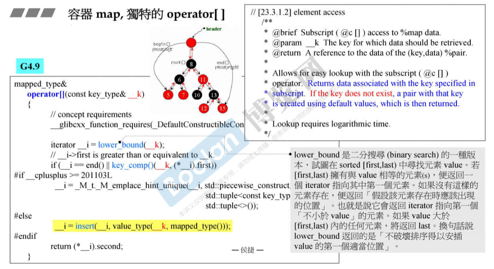

### unordered_map 和 unordered_set

unordered_map 和 unordered_set 底层都通过 hashtable 实现，标准库的实现通常有一个 hashtable class。

**hash-code 如何产生？** 标准库的实现对整数类型直接使用本身作为 hash-code，对应 `char*` 类型则通过每一个字符来计算产生。那小数以及 object 呢？

**hashtable 扩容**：当哈希表中存储元素个数超过表长时（也可以是其他规则，大部分实现是这样做），将表长扩展到当前长度的二倍附近的质数（表长通常保持为质数）。**然后将表中所有元素的hash-code 对新表长取模，放置到新的正确的位置。**

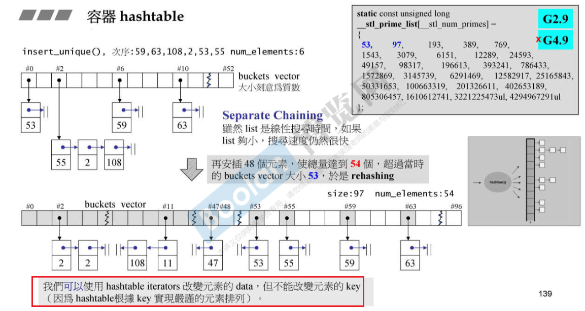

### 迭代器

#### 关于迭代器和 iterator traits （迭代器萃取器）

迭代器是泛化的指针，容器的迭代器通常是一个 class，`vector<int>::iterator it = vec.begin()` 即创建了一个迭代器对象，每个容器专属的迭代器 class 为对应的容器做了完美适配。

iterator traits 通过模板偏特化来区分 class iterators 和 non-class iterators，从而可以在泛型算法中通过迭代器对象（或指针）获取正确的元素类型等信息：  

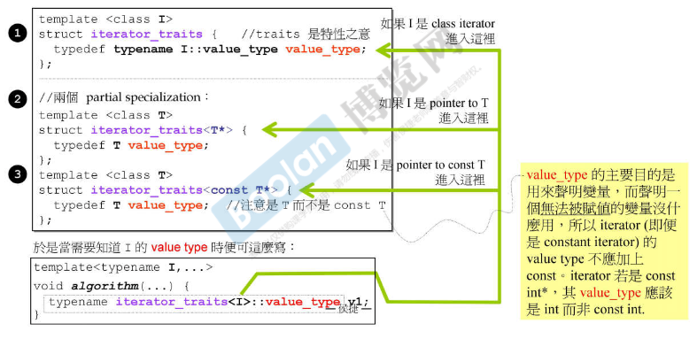

#### 迭代器的类别

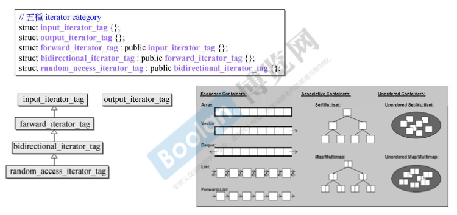

将迭代器类别使用 class 来实现，并使用继承体系，主要目的是为了便于模板算法针对不同类别迭代器实现相应的版本。

比如下图的 `distance()` 函数，针对继承链最底端的 `random_access_iterator_tag` 实现了一个版本，针对继承链最顶端的 `input_iterator_tag` 实现了一个版本，这样一来除了 `random_access_iterator_tag` 类型的迭代器，继承链中其他类迭代器（不包括 `output_iterator_tag` 将调用 `input_iterator_tag` 类版本，因为派生类对象向基类对象的转型。（具体的实现是，通过迭代器萃取器获取 `InputIterator` 类型的迭代器类型，并创建一个临时对象，函数将按照规则进行类型匹配）

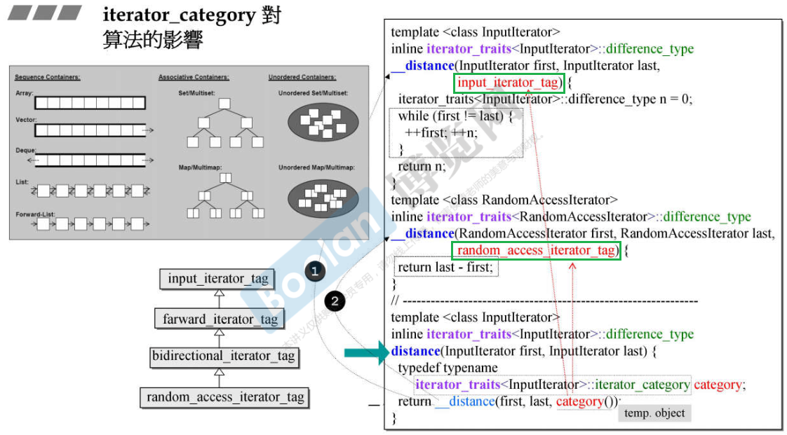

> 泛型算法看不见容器，对其一无所知；它需要的一切信息都必须从 iterators 取得，而 iterators（由容器提供） 必须能够回答算法的所有提问。算法通过迭代器种类来实现不同的操作，这事关效率。

### 一些算法

- 关联式容器有自己的成员函数版本：`.count()`、`.find()`，但关联式容器不能使用 `sort()` 。

模板算法接收迭代器类型作为参数，没有限制哪些容器的迭代器类型才可以，但暗示了迭代器类型。如下图，`sort()` 只能使用随机访问的迭代器（使用其他迭代器也不会报错，但不能成功）。

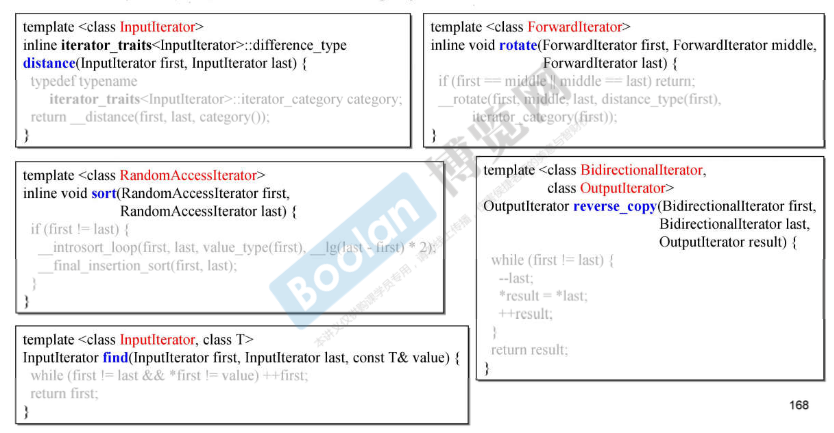

- list 和 forward_list 容器有自带的 `.sort()`

### 关于只有 typedef 的基类

基类中只有一系列的 typedef，所有继承自该基类的派生类都具有这一系列 typedef，有助于在实现时有相同或类似的写法。比如：

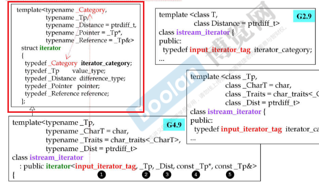

> 到第 30 讲
