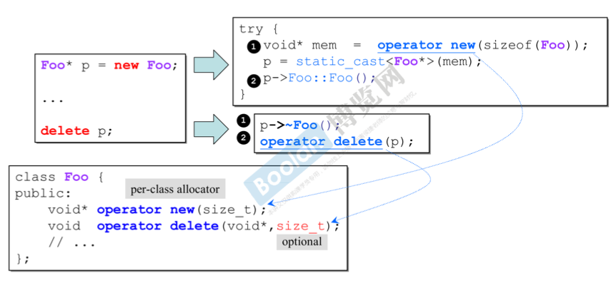
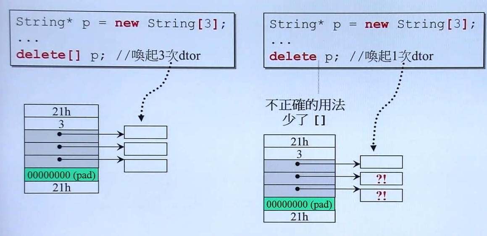
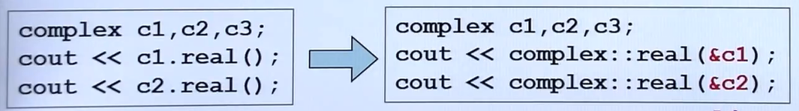

# 基于对象 - 单一的 class

## 不带指针的类 Complex

#### 关于头文件中的防卫式声明

在头文件中加入如下这样的防卫式声明是很有必要的，防止多次重复引入同一头文件：

```cpp
// complex.h
#ifndef __COMPLEX__
#define __COMPLEX__
...
#endif
```


#### 关于构造函数

##### 默认构造函数

如果没有自定义构造函数，那么编译器会为我们定义一个默认构造函数，对大多数类来说它按照如下规则初始化类的数据成员：

+ 如果存在类内初始值，用它来初始化成员（C++11 支持为数据成员提供一个类内初始值）；
+ 否则，对于内置类型成员将不被初始化，对于类类型成员将调用默认构造函数。

一个未被初始化的内置类型成员的值是未定义的，因此为成员变量提供一个类内初始值是一个好习惯。如果编译器不支持C++11，那么好的做法是在所有构造函数中初始化所有成员。

##### 定义构造函数

写一个构造函数时，应尽量使用构造函数的特殊语法（初始值列表）来初始化成员变量，而不要在函数体内采用赋值的方法。

```cpp
// 构造函数初始值列表，提倡的方法
complex (double r=0, double i=0)
  : re(r), im(i) {}

// 低效的方法
// 事实上先执行默认构造函数，然后执行该构造函数体内的“赋值语句”
complex (double r=0, double i=0) {
  re = r; im = i; // 这不是初始化，是赋值
}
```

事实上，有时必须使用构造函数初始值列表。

如果没有在构造函数的初始值列表中显式地**初始化**成员，即使用第二种构造函数，则将在构造函数体之前执行默认初始化，然后在函数体中执行**赋值**操作。因此，如果成员是 const 或者是引用的话，则只能使用初始值列表进行初始化，因为不能对一个 const 或者引用赋值。

> 参看 *《C++ Primer 中文版 第5版》* 第258页


#### 关于常量成员函数

```cpp
// 在参数列表之后紧接一个 const 关键字，这样的成员函数称为常量成员函数
double real() const { return re; }
```

这里 const 的作用是修改隐式 this 指针的类型。在默认情况下 this 的类型是指向类类型的非常量版本的常量指针，因此对于没有 const 修饰的普通成员函数，将不能被一个常量对象调用（无法将指向非 const 对象的 this 绑定到一个 const 对象上）。

因此对于不应修改 data 的成员函数以 const 修饰，不止是为了防止使用者修改 data 而已。在一定程度上，不以 const 修饰是一种错误。

> 关于 隐式 this 指针，试着这样理解：对于一个 complex 对象 `c1` ，它调用 `real()` 成员函数时，则隐式地将一个指向对象 `c1` 的指针 `this` 传递给了函数 `real()` ，在函数内执行 `return this->re;` 从而取得对象 `c1` 的实部。

简单来说：**this 本身是一个顶层 const，常量成员函数为 this 加上一个底层 const，使得常量对象也可以调用该成员函数**（即将其地址赋值给 this）。

> 参看 *《C++ Primer 中文版 第5版》* 第231页对 const 成员函数的介绍。


#### 关于友元

complex 类可以允许其他类或函数访问它的 private 成员，以 friend 关键词修饰对应的类或函数使其成为 complex 类的友元即可：

```cpp
class complex{
    // 将成员函数声明为友元
    friend complex& __doapl (complex*, const complex&);
    
    // 将非成员函数声明为友元
    friend complex complex& my_doapl (complex*, const complex&);

    // 相同 class 的各个 objects 互为 friends
    // complex c1(2,1), c2;
    // c2.func(c1);
    int func(const complex& param)
    { return param.re + param.im; }
}
```

+ 相同 class 对各个对象互为友元（可以互相访问 private 成员）。


#### 关于重载函数

```cpp
// 以重载 complex 类的构造函数为例：
complex (double r=0, double i=0)
  : re(r), im(i) {}

complex () : re(0), im(0) {} // 不可行！
```

这样的重载函数是不可以的，也是多余的！虽然二者参数列表不同，但第一个构造函数为每一个形参都提供了默认值，当使用如下方法定义一个 complex 类时，编译器不知道该调用哪一个。

```cpp
// 两种方法等价，都表示不提供参数调用 complex 构造函数
complex c1;
complex c2();
```


#### Complex 类总览 (及操作符重载)

```cpp
#ifndef __COMPLEX__ // 防卫式声明
#define __COMPLEX__

class complex
{
public: // 方法公共
  // 对于函数参数并不总是应该传引用，传引用相当于拷贝一个指针 4 字节
  // 当数据是 char, int 等不大的类型时就没有传引用的必要
  complex (double r = 0, double i = 0): re (r), im (i) { } // 使用初始值列表的构造函数
    
  // 所有的成员函数都带有一个隐藏的参数 this 指针，指向调用函数的对象
  complex& operator += (const complex&); // 以成员函数实现操作符重载时应该省略被加数
  double real () const { return re; } // 如果函数内部不改动数据，应该使用 const
  double imag () const { return im; }
private: // 数据私有
  double re, im;

  // 非成员函数需要使用数据时，将其声明为 friend
  friend complex& __doapl (complex *, const complex&);
};

inline complex&
__doapl (complex* ths, const complex& r)
{
  ths->re += r.re;
  ths->im += r.im;
  return *ths;
}
// 将成员函数体写在类外，需要指定其 namespace 为 complex
// 如果返回的不是局部对象（不是在函数内创建的），就可以返回引用
// 返回引用将支持：c3 += c2 += c1;
inline complex& complex::operator += (const complex& r)
{
  return __doapl (this, r);
}

// 对于加法重载，不以成员函数实现
// 因为当以成员函数实现时，只能以复数作为被加数，不能实现实数加复数
// 因为返回的是函数内创建的局部对象，因此返回类型必须是传值
inline complex operator + (const complex& x, const complex& y)
{
  return complex (x.real() + y.real(), x.imag() + y.imag()); // 临时对象
}
// .....

// << 重载当然也必须是非成员函数，因为不可能有这样的使用 c1 << cout
// 输出流会改变，因此不能加 const
// 由于可能这样使用 cout << c1 << endl; 因此需要返回输出流，并且应该是传引用
ostream& operator << (ostream& os, const complex& x)
{
  return os << '(' << x.real() << ',' << x.imag() << ')';
}

#endif
```

<br>


## 带指针的类 String

#### 关于 Big Three

**class with pointer members** 必須要有 

+ **copy ctor** (拷贝构造) 
+ **copy op=** (赋值构造) 
+ **析构函数**


#### 关于拷贝构造函数

```cpp
inline
String::String(const String& str){
  	m_data = new char[ strlen(str.m_data) +1 ]; // 同类对象互为friend，直接取另一个object的private data
  	strcpy(m_data, str.m_data);
}

{
  	String s1("hello ");
  	String s2(s1);
//  String s2 = s1; 与s2(s1)一样调用拷贝构造函数，因为这里定义一个新对象，所以不是拷贝赋值
}
```
**拷贝构造函数的参数必须是引用类型**：如果参数不是引用类型，则调用永远不会成功——为了调用拷贝构造函数，外面必须拷贝它的实参，但为了拷贝实参，有需要调用拷贝构造函数。
> *《C++ Primer 中文版 第5版》* 第442页。

**合成拷贝构造函数**：会将其参数的成员**逐个拷贝**到正在创建的对象中。不同于合成构造函数，无论是否定义拷贝构造函数，编译器都会合成拷贝构造函数。
```cpp
class Sales_data {
    public:
        // 显示要求编译器合成默认构造函数
        Sales_data() = default;
        Sales_data& Sales_data::operator=(const Sales_data&) = default;

        // 定义为"删除的函数"，来阻止拷贝 c++11
        Sales_data(const Sales_data&) = delete;
        // 也可以将构造函数定义为 private 以阻止拷贝，但不能阻止友元和成员函数，使用 =delete 是更好的选择
};
```


#### 关于拷贝赋值

```cpp
inline
String& String::operator=(const String& str){
  	if(this == &str) // 检测自我赋值
      	return *this;
  	
  	delete[] m_data; // 第一步
  	m_data = new char[ strlen(str.m_data) + 1 ]; // 第二步
  	strcpy(m_data, str.m_data); // 第三步
  	return *this;
}
```

**特别注意对自我赋值的检测！这一点尤其重要！**

看到的第一层似乎只是对效率的提升，而更深一层更为重要：如果没有对自我赋值的检测，那么进行第一步释放内存时即将自身的 data 给释放掉了，那第二步再要取 data 从何而来呢？
> 此外，如果一个运算符是一个成员函数，其**左侧运算对象就绑定到隐式的 this 参数**。


#### 关于交换操作

> *《C++ Primer 中文版 第5版》* 第457页。

如果没有定义自己的 swap 函数，使用标准库的 swap 操作可能是这样：

```cpp
String temp = s1; // copy s1
s1 = s2; // delete s1, copy s2
s2 = temp; // delete s2, copy s1
```

这些多余的操作是没有必要的。因此为了效率有必要定义自己的 swap 函数：

```cpp
inline
void swap(String &ls, String &rs){
    using std::swap;
    // 使用 swap 而不是 std::swap，因为成员有可能也有自己的 swap
    swap(ls.m_data, rs.m_data); // 交换指针而不是 data
}
```

如果定义了 swap，那么可以**在赋值运算符中使用 swap，这样可以自动处理自赋值情况且天然就是异常安全的。**此外，与原来的拷贝赋值相比具有同等的效率，在传递实参时执行了一次拷贝构造，此后没有新的内存消耗和操作。

```cpp
String& String::operator=(String rs){
    swap(*this, rs); // 交换左侧运算对象和局部变量 rs 的内容
    return *this;
} // rs 被销毁，从而 delete 了 rs 中的指针
```


#### 对象移动

> *《C++ Primer 中文版 第5版》* 第470页。

**C++11 可以移动而非拷贝对象。**移动对象是很有必要的，比如对于一个 `vector<String>` ，当分配的内存不能添加新成员时，需要新分配一块更大的内存，并将原来的数据“移动”到新内存中。如果没有所谓的“移动”操作，则只能拷贝过去。拷贝一份新数据又将原来数据 delete，这明显是多余的。


#### 关于 new 和 delete

使用 `new` 和 `delete` 来创建和删除对象，是一个固定的表达式，这无法改变。但表达式被拆分为几个步骤，可以对这些步骤的操作符 `operator new` 、`operator delete` 进行重载：

值得注意的是：在使用 `new` 和 `delete` **表达式**时并不需要提供任何参数，表达式被拆分的第一步调用 `operator new(sizeof(Foo))` 会自动计算需要的内存大小，提供给参数 `size_t`。



> 需要注意的是，上述重载在 `class Foo` 内部，因此只对 `Foo` 类的 `new` 和 `delete` 有效。而如果在类外部，则重载的是全局操作符，将产生全局的影响！危险！！
>
> 如果用户不想使用类内重载的 `new` 或 `delete` ，使用 `::new` 显示地调用全局版本。

#### 关于堆、栈与内存管理

在函数体内声明的变量存储在 stack 中，函数体结束后自动释放其占用的所有内存。
动态分配（new），则使用 heap 中的内存，只有手动 delect 时才释放内存。

```cpp
class Complex {...};
...
/************ stack objects ************/
{
    // 其生命在作用域结束之后就结束了
    Complex c1(1, 2);
} // 函数体结束，内存释放

/********* static local objects *********/
{
    // 其生命在作用域结束之后仍然存在，直到整个程序结束
    static Complex c2(1, 2);
}

/************ global objects ************/
// 作用域是整个程序，其生命在整个程序结束之后才结束
Complex c3(1, 2);
int main() {
    ...
}

/************* heap objects *************/
{
    // 其生命在它被 delete 之后才结束
    Complex* p = new Complex;
    ...
    delete p;
}
```

此外，array new 一定要搭配 array delete




#### String 类总览

```cpp
class String
{
public:                                 
   String(const char* cstr=0);                     
   String(const String& str); // 拷贝构造
   String& operator=(const String& str); // 拷贝赋值
   ~String(); // 析构函数
   char* get_c_str() const { return m_data; }
private:
   char* m_data; // class with point member
};

#include <cstring>
inline String::String(const char* cstr)
{
   if (cstr) {
      m_data = new char[strlen(cstr)+1];
      strcpy(m_data, cstr);
   }
   else {   
      m_data = new char[1];
      *m_data = '\0';
   }
}

inline String::~String()
{
   delete[] m_data; // new 出来的内存都需要手动 delete
}

inline String::String(const String& str)
{
   m_data = new char[ strlen(str.m_data) + 1 ];
   strcpy(m_data, str.m_data);
}

// 因为考虑到可能连续赋值，因此应该返回
inline String& String::operator=(const String& str)
{
   if (this == &str) // 检测自我赋值
      return *this;

   delete[] m_data;
   m_data = new char[ strlen(str.m_data) + 1 ];
   strcpy(m_data, str.m_data);
   return *this;
}
```


## 补充

#### static

首先看看普通的情况：对于一个 class 的多个对象，他们有各自独立的成员变量，但是**使用同一份成员函数代码**。当不同的对象调用成员函数时，传入 this 指针来标识自己，但内存中只存有一份函数代码，不同对象共享。



**static 成员变量：**所有对象共享

**static 成员函数：**与非 static 函数一样，不同对象使用同一份函数代码，但是 static 函数没有接收 this 指针的参数，因此不能访问对象的非 static 变量，只能访问 static 成员变量。

```cpp
class Account {
public:
    static double m_rate; // 声明
    static void set_rate(const double& x) { m_rate = x; }
};
double Account::m_rate = 8.0; // 定义（声明只指明了变量类型和名字，定义则为其分配了内存）

int main() {
    Account::set_rate(5.0); // 通过 class name 调用
    
    Account a;
    a.set_rate(7.0); // 通过 object 调用
}
```

**Meyers Singleton** 设计模式：无法自己创建这个 class 的对象，只有使用时才可以获得，并且永远只有一份：

```cpp
class A {
public:
    static A& getInstance();
    setup() {...}
private:
    A(); // 构造函数私有
};

A& A::getInstance() {
    static A a;
    return a;
}
```


#### 模板类 template class

```cpp
template<typename T>
class complex {
public:
    complex (T r = 0, T i = 0) : re(r), im(i) {}
    ...
}

{
    complex<double> c1(2.5, 1.5);
    complex<int> c2(2, 6);
}
```

模板会导致代码的“膨胀”，比如上面的 complex 类，当使用 double 时会将所有的 T 置换为 double 产生一份代码，当使用 int 时又会同样的产生另一份代码。但这种膨胀是必要的。


#### 模板函数 template function

```cpp
template <typename T>
inline
const T& min(const T& a, const T& b) {
    return b < a ? b : a;
}

{
    complex c1(2, 3), c2(3, 3), c3;
    c3 = min(c1, c2);
}
```

调用模板函数时不需要像调用模板类时那样指定 type，编译器会对模板函数进行“参数推导”。

`<algorithm.h>` 库中的各种算法都是模板函数实现。
