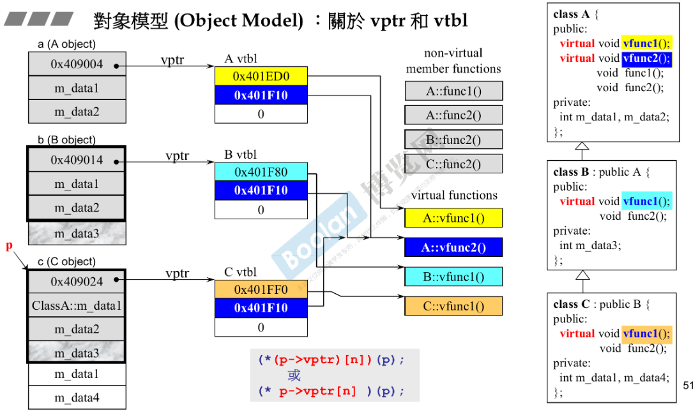

# 对象模型

### 关于 vptr(虚函数指针) 和 vtbl(虚函数表)

- 子类会继承父类的成员**变量**，内存中包含齐大小；
- 而继承成员**函数**是继承它的调用权，而不是它的大小。
- 子类会有自己的虚函数指针，指向自己的虚函数表。当指向子类对象(b)的父类指针(A*)调用虚函数时，实际上会调用 `b->vptr` 所指向的 vtbl 中所对应的函数（动态绑定）。

> 通常调用函数是静态绑定，即直接 call 某个地址。但当符合以下条件时，会执行“动态绑定”，即实际调用的函数是不确定的。
> 1. 通过指针调用
> 2. 指针被“向上转型”
> 3. 调用的是虚函数

