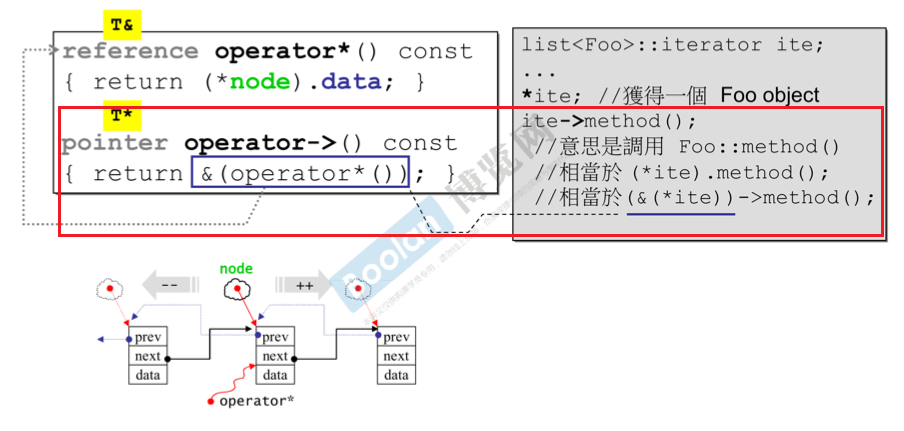
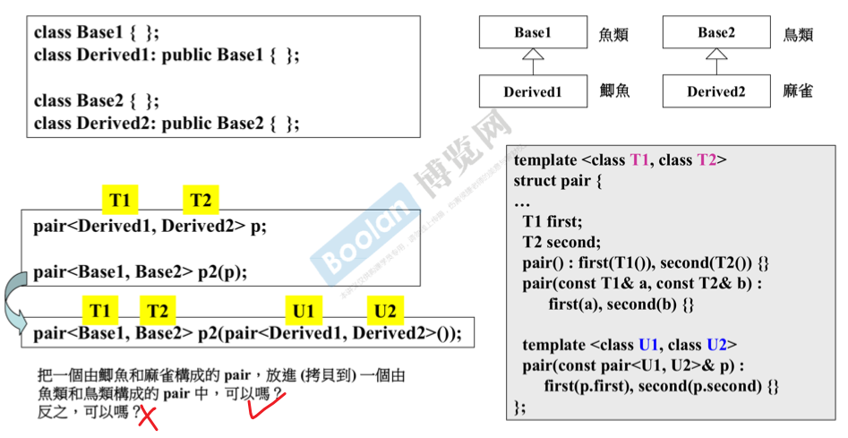
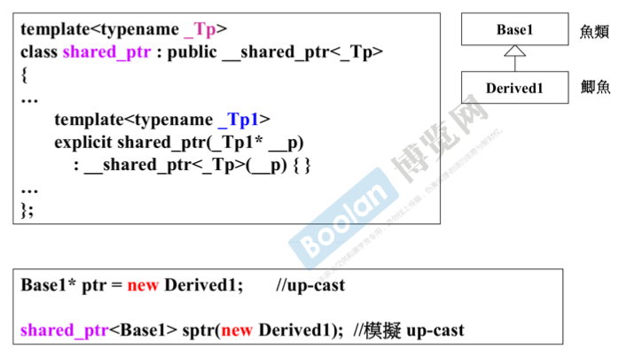
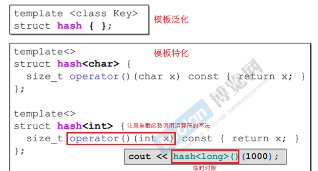
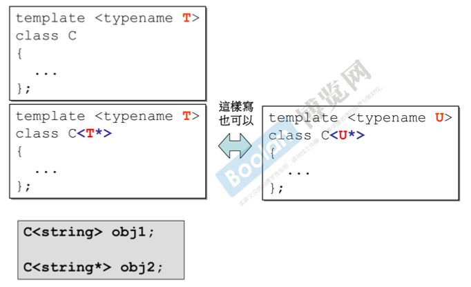
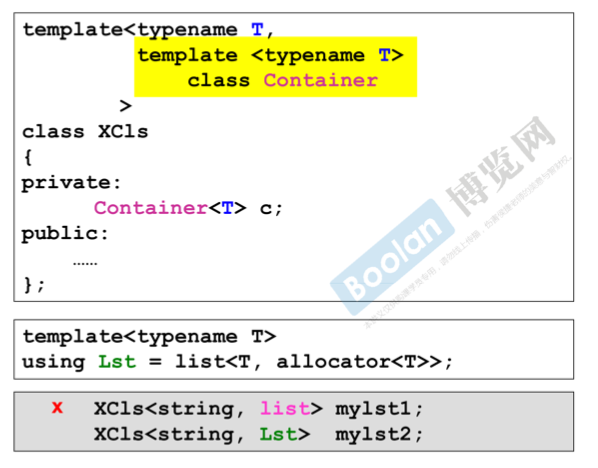

### 关于（类）类型转换

- **conversion function 转换函数**

    注意其写法即可：

    ```cpp
    class Fraction
    {
    public:
        explicit Fraction(int num, int den=1) 
          : m_numerator(num), m_denominator(den) { }
    
        operator double() const { 
          return (double)m_numerator / m_denominator; 
        }
    
    private:   
       int m_numerator;    // 分子
       int m_denominator;  // 分母
    };
    
    // 可以在需要 double 的地方使用 Fraction，编译器将执行模型类型转换
    Fraction f(3, 5);
    double d = 4 + f; // 调用 operator double()
    ```

- **non-explicit-one-argument ctor 非 explicit 的单参数构造函数**，可以执行隐式类型转换。见 *《C++ Primer》* P516

- 当同时存在“转换函数”和“可以隐式类型转换的构造函数”时，可能产生二义性：

  ```cpp
  class Fraction
  {
  public:
  	Fraction(int num, int den=1)  // 没有 explicit 修饰
  	  : m_numerator(num), m_denominator(den) { }
  	
   	operator double() const { 
        return (double)m_numerator / m_denominator; 
   	}
   	Fraction operator+(const Fraction& f) { 
  	   return Fraction(...); 
  	} 
  };
  Fraction f(3,5);
  Fraction d2 = f + 4; // 二义性
  ```

### pointer-like classes 关于智能指针

- C++2.0 之前有 `auto_ptr`，之后有 `shared_ptr/unique_ptr/weak_ptr`. 智能指针类似于OC使用引用计数自动管理动态内存。见 *《C++ Primer》* P400

- 自己实现的 `shared_ptr` 类，注意其重载的 `->` 可以这样使用（有点难以理解，“`->` 会循环地作用下去”）

  ```cpp
  template <class T>
  class shared_ptr
  {
  public:
      T* operator->() const
      { return px; }
      
      shared_ptr(T* p) : px(p) { }
  private:
      T* px;
  };
  
  struct Foo
  {
      void method();
  };
  shared_ptr<Foo> sp(new Foo);
  sp->method(); // 可以这样子使用，相当于 px->method();
  ```

- 迭代器也相当于一种特殊的智能指针。下图是链表迭代器，注意它对 `->` 操作符的重载又不一样：

  

### function-like classes 调用操作符

- 如果对一个 class 重载了函数调用操作符 `()` ，那么就可以像函数一样使用这个 class 的对象。见 *《C++ Primer》* P506
- 标准库中的一些 function-like class （重载了函数调用运算符）通常会继承一些奇特的基类。详见 STL 课程。

### 模板

- **成员模板-模板类的模板构造函数**

  通过为模板类定义一个模板构造函数，可以使用派生类实例化一个模板类，并将其作为基类实例化模板时的构造函数初始值。如下图所示：

  

  由于指针有 up-cast 的性质（即基类指针可以指向派生类对象），智能指针也可以通过成员模板模仿这种行为：

  

> 参考 *《C++ Primer》* P534, 535
>
> 变量或表达式具有“静态类型”和“动态类型”。基类的指针或引用可以指向或绑定派生类对象，此时将具有不同的静态类型和动态类型，当它调用虚函数时则将为动态类型（派生类）的版本。
>
> 派生类对象也可以通过拷贝或赋值的方式转换为基类对象（而不是基类指针或引用），但此时派生类对象中的派生类部分被“切掉”，只剩下基类部分，动态类型和静态类型一样。
>
> 成员模板中使用派生类对象初始化基类对象，取决于基类对象类型：**如果是 pair 类的例子，则相当于第二种（对象之间的拷贝赋值转换）；如果是智能指针的例子，则相当于第一种（基类指针指向派生类对象）。** （附录有补充示例说明，更容易理解）

- **模板特化**

  比如对于模板函数 `hash`，针对某一种类型，它有特有的写法，而不是所有类型都一样。可以通过特化某一类型来实现：

  

- **模板偏特化**

  **个数上的偏**：有多个模板参数，只特化其中部分。

  **范围上的偏**：原本的泛化类型 `T` 可以是任意类型，通过范围偏特化，指定指针类型的版本：

  

- **模板模板参数**

  模板类或模板函数的模板参数本身也是模板：

  


### 附录

```cpp
// 关于成员模板的补充说明
class base {
public:
    virtual void menthod(){
        cout << "This is Base" << endl;
    }
};

class derived: public base{
public:
    void menthod(){
        cout << "This is Derived" << endl;
    }
};

template <typename T>
class box{
public:
    template <typename T1>
    box(T1& _c) : c(_c) {}
    
    void menthod(){
        c.menthod();
    }
private:
    T& c; // This is Derived
    T c; // This is Base
};

int main(){
    derived d;
    box<base> b(d);
    b.menthod();
    
    return 0;
}
```

