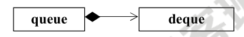
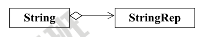
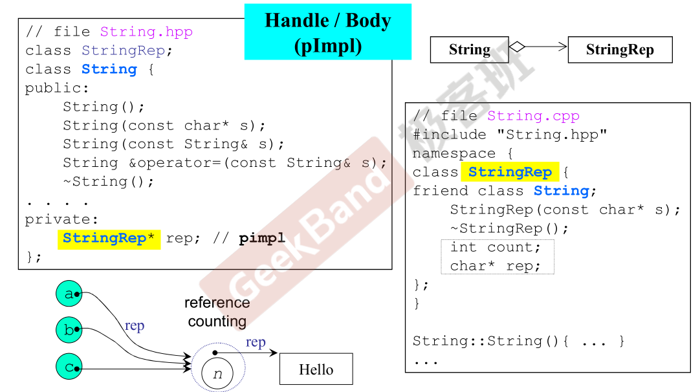
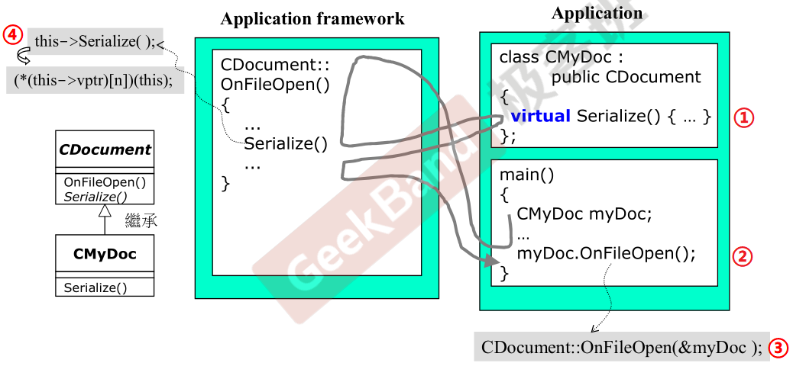
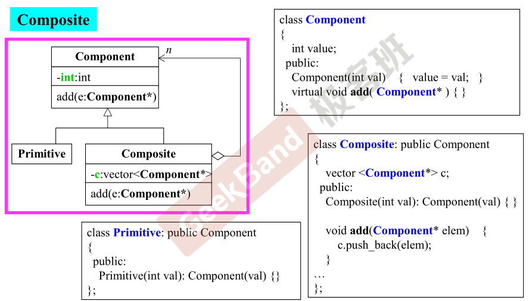

# 面向对象 - class 与 class 之间的关系

### Composition 复合   has-a

**即 class 中有另一种 class。** 比如容器 `queue` 使用 `deque` 作为底层容器时，queue has a deque:



*<u>Adapter 设计模式</u>* 就是一种 composition：已经有的一个强大的 class deque，现在实现 queue 只需要在 deque 的基础上开发新的接口即可（只开放部分功能）。比如使用 deque 作为底层容器的 queue:

```cpp
template <class T, class Sequence = deque<T> >
class queue {
    ...
protected;
    Sequence c; // 底层容器
public:
    // 以下完全利用 c 的操作函数完成
    bool empty() const { return c.empty(); }
    size_type size() const { return c.size(); }
    reference front() { return c.back(); }
    void push(const value_type& x) { c.push_back(x); }
    void pop() { c.pop_front(); }
};
```

Composition 关系下的构造和析构：

**构造由内而外**：queue 的构造函数先调用 deque 的默认构造函数（或者自己指定），然后才执行自己。

```cpp
queue::queue(...): deque() {...};
```

**析构由外而内**：queue 的析构函数先执行自己，然后才调用 deque 的析构函数。

```cpp
queue::~queue(...) { ... ~deque() };
```

### Delegation 委托    Composition by reference

**即 class 中有另一种 class，但不是实例对象，而是指向那个 class 对象的指针。** 是一种 reference 的复合。比如对于 String 类



不在 class 中实现成员变量和成员函数，而是通过 StringRep 来实现，而 String 类中只有一个指向 StringRep 的指针。这种 pointer to implementation(pImpl) 的设计隐藏了类实现的细节，形成“编译防火墙”，当修改实现时，只需要重新编译 StringRep 部分。



此外需要注意的是，当有多份相同的 String 对象 a, b, c 时，指向同一个 StringRep 可以节省内存，通过引用计数来保证 StringRep 对象的生命。当某一个对象 a 想要改动数据时，则为 a 单独拷贝一份 StringRep 对象 (**copy on write**)

### Inheritance (public)继承 is-a

```cpp
struct _List_node_base
{
	_List_node_base* _M_next;
	_List_node_base* _M_prev;
};
template<typename _Tp>
struct _List_node: public _List_node_base // public 继承
{
	_Tp _M_data;
};
```

- 子类会完整继承父类的成员变量。

- 继承关系下的构造和析构与复合关系下的一样，因为实际上一个子类对象中 has a 父类对象。因此也是“构造由内而外，析构由外而内”。

- **父类的析构函数必须是虚函数 (virtual functions)。** 因为派生类有基类部分和自定义部分，如果基类的析构函数不是虚的，则在 delete 一个指向派生类的基类指针时将调用基类的析构函数。

- struct 和 class 的区别：默认访问权限不同，struct 的成员默认是 public 的，并且默认 public 继承父类；而 class 的成员和继承方式则默认为 private

public/private/protected 继承？

#### 虚函数

non-virtual 函数：你不希望子类重新定义（overwrite 复写）。

virtual 函数：你希望子类重新定义，但父类已经有了默认定义，即使子类不重新定义也可以。

pure virtual 函数：你希望子类一定要重新定义，父类没有默认定义（或者是不知道如何定义），子类必须重新定义。

```cpp
class Shape{
public:
	virtual void draw( ) const = 0; // 纯虚函数
	virtual void error(const std::string& msg); // 虚函数
	int objectID( ) const; // 非虚函数
...
};
class Rectangle: public Shape { ... };
class Ellipse: public Shape { ... };
```

**<u>Template Method 设计模式</u>**：把大量的固定的操作写好，留下无法决定的函数写成虚函数，让子类实现：



1. 子类复写虚函数；
2. 子类对象 myDoc 调用父类方法，执行父类中定义的操作，当到达虚函数部分跳到子类的定义处，虚函数完毕回到父类方法中继续执行，结束后再跳回子类。
3. 4.子类调用父类方法时如何转而执行子类实现的虚函数？子类对象调用时传递 this 指针，在执行到虚函数时实际上执行 `this->Serialize();` ，从而调用了自己实现的虚函数。

> 虚函数和虚函数表？参考[对象模型](./对象模型.md)

### 委托 + 继承

##### <u>Observer 观察者设计模式</u>

同一份数据，可以通过若干个视窗 (view) 来观察：


##### <u>Composite 组合设计模式</u>

Composite 是一个目录，目录中既可以包含基础文件(Primitive)又可以包含目录，因此将 Primitive 和 Composite 都继承自 Component 基类，然后在 Composite 中包含指向基类的指针 vector:


