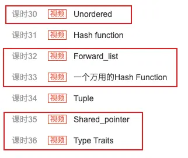

### 2022年1月11日更新

对 b 站侯捷系列视频的统一回应:eyes:

1. 目前侯捷系列所有视频均被下架，Boolan网（版权所有方）已通知我侵权，因此后续不会再上传；

2. 所有视频均已上传阿里云盘，请大家移步阿里云盘观看：[侯捷全系列](https://www.aliyundrive.com/s/d3WQCUgj1L2)；

3. GitHub访问不方便的，在蓝奏云也放了一份：[PPT 和代码](https://fishe.lanzoul.com/s/cpp)；

4. 有很多同学问视频学习顺序，最先学 面向对象上、下和 STL 标准库，之后其他的视频自己就有把握了；

5. 视频并不完整，不用费力气找，这里是全网最全的。缺少的部分：

   - STL部分：p25是重复了p23的，这里**缺少p25**的视频；p27就是p28的开头，但**这里没有缺失**，课程内容是连贯的，应该是原视频没剪辑好。

   - C++新标准部分：p29前面的都是完整的，主要是最后几个课时缺少了p30、32、33、35、36（下图圈出部分）

     

   - 除了这些，全系列其他视频应该都是完整的。

以上:fish:

--------

:see_no_evil: 对 [b 站视频](https://space.bilibili.com/435866355) 的**附带资料**（如课件、源代码等）进行备份，防止云盘链接失效。

:hear_no_evil: 对**视频**进行更新。如果因版权问题稿件被退回，将以其他方式发布视频并在此更新，防止看到一半就没了。

:speak_no_evil: 如果需要下载仓库中的文件但受不了 GitHub 的速度，请看 [下载方法](./Download-method.md)。

---

# 侯捷 C++ 系列

### C++ 面向对象高级编程(上)

+ :tv: [视频](https://www.bilibili.com/video/BV1Lb4y1R7fs)
+ :page_facing_up: [源代码和课件](./C++-OOPBase1-HouJie/)

### C++ 面向对象高级编程(下)-兼谈对象模型

+ :tv: [视频](https://www.bilibili.com/video/BV1ZX4y157Bu)
+ :page_facing_up:  [源代码和课件](C++-OOPBase2-HouJie/)

### C++标准库(STL)与泛型编程

+ :tv: [视频](https://www.bilibili.com/video/BV1BX4y1G7bX)
+ :page_facing_up:  [源代码和课件](./C++-STL-HouJie)

### C++新标准-C++11&14

+ :tv: [视频](https://www.bilibili.com/video/BV1Rp4y1n7fb)
+ :page_facing_up:  [课件](./C++-newC++11&14-HouJie)

### C++内存管理机制-从平地到万丈高楼

+ :tv: [视频](https://www.bilibili.com/video/BV1Er4y1A7Xy)
+ :page_facing_up:  [课件](./C++-MemoryManagement-HouJie/)

### C++Startup揭秘-C++程序的生前死后

+ :tv: [视频](https://www.bilibili.com/video/BV17N41197DV)
+ :page_facing_up:  没有课件

### C++设计模式-李建忠

- :page_facing_up:  [源代码和课件](./C++-DesignPattern)

+ :pray: [转载来源](https://mooc.study.163.com/smartSpec/detail/1001137001.htm)

 

# MATLAB 基础教程-台大郭彦甫

+ :tv: [视频](https://www.bilibili.com/video/BV1DA411Y7bN)
+ :page_facing_up:  [课件和笔记](./MATLAB-Base-YanfuKuo/)
+ :pray: [转载来源](https://www.youtube.com/watch?v=KHFZLkm9qs0&t=197s)

# MATLAB 数据科学系列

+ :tv: [视频](https://www.bilibili.com/video/BV11o4y1R7p9)
+ :page_facing_up:  [源代码和数据](./MATLAB-DataScience-MathWorks/)
+ :pray: [转载来源](https://ww2.mathworks.cn/videos/series/data-science-tutorial.html)

---

:exclamation::exclamation: 说明：转载视频的初衷是为了方便观看，由于部分视频来源于商业机构，可能追究起来 b 站一声不吭地就下架了，为了避免大家学着学着视频没了，所以才有了这个仓库。

视频和资料都都是废了不少时间和精力搜集起来的，并且对每一个视频都注明了转载来源，希望大家白嫖之后可以对原作者做一些力所能及的支持，尤其是原视频本身就是无偿观看的作者，哪怕是跑到 [郭彦甫老师的 YouTube 主页](https://www.youtube.com/user/machinelearningandvi) 说声谢谢呢 :pray:

另外，正常情况下视频都不会出啥意外，放心看就好了。挂了就来这个页面看看吧，如果没有及时更新可以 [b站私信我](https://space.bilibili.com/435866355) 。祝各位 学有所成！:v: